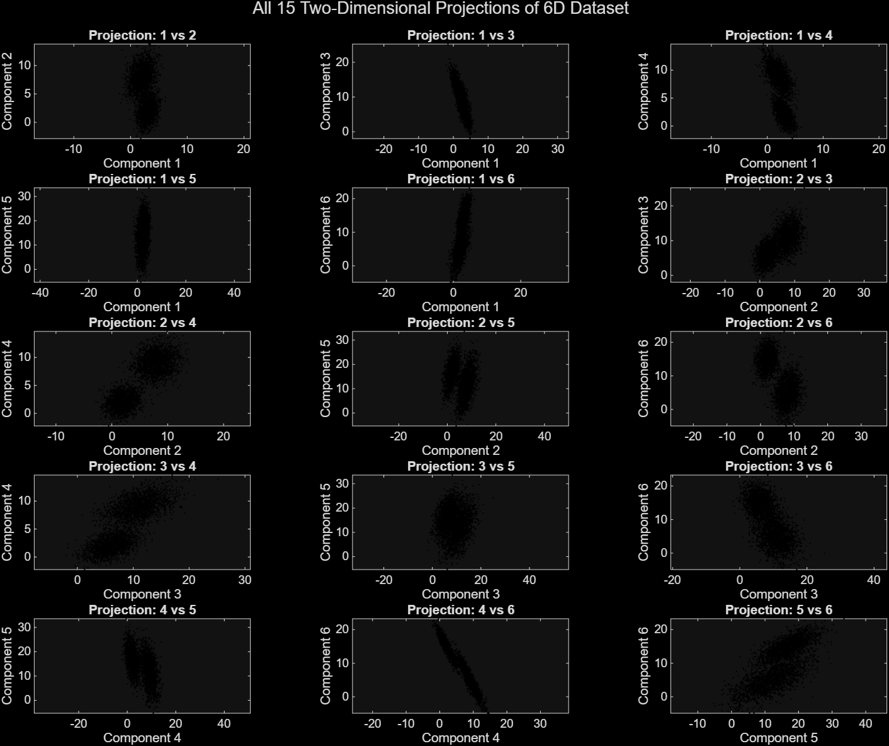
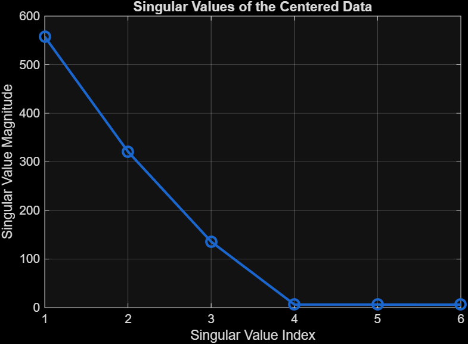
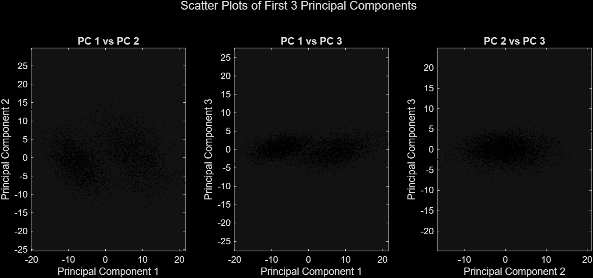
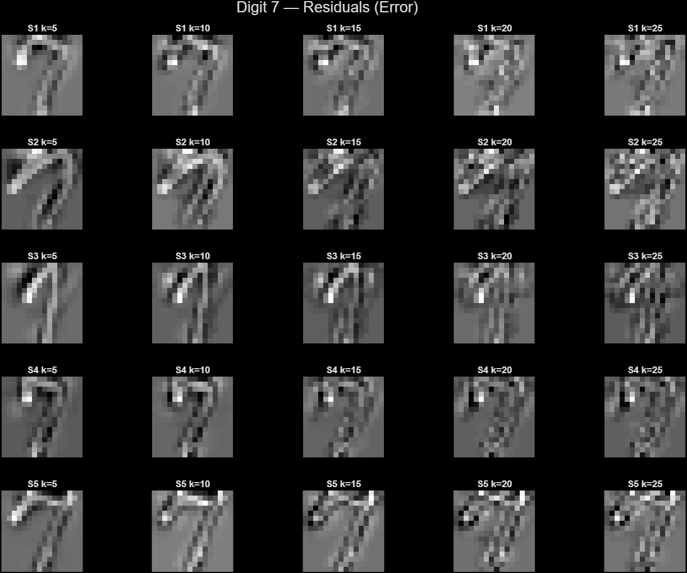
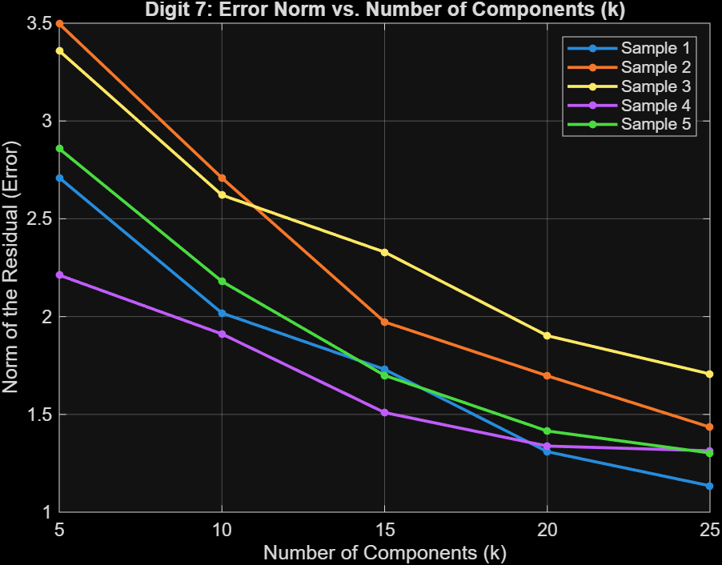

# SVD & PCA Numerical Analysis
### Singular Value Decomposition · Principal Component Analysis · Dimensionality Reduction

A MATLAB-based project demonstrating how **Singular Value Decomposition (SVD)** and **Principal Component Analysis (PCA)** can be applied to real-world datasets for dimensionality reduction, data compression, visualization, and pattern discovery.

---

## Overview

High-dimensional datasets are often costly to store, computationally intensive to process, and difficult to interpret. This project explores how SVD—serving as the mathematical foundation of PCA—addresses these challenges through:

- Efficient **dimensionality reduction** while preserving key information  
- **Image compression** via low-rank matrix approximations  
- Identification of **hidden structures and patterns** in data  
- Evaluation of **reconstruction error** relative to retained components  

The analysis spans synthetic and real-world datasets, demonstrating both theoretical and practical applications.

---

## Datasets

| Dataset | Dimensions | Description |
|--------|-----------|-------------|
| `ModelReductionData.mat` | 6 × 4000 | Synthetic high-dimensional dataset |
| `HandwrittenDigits.mat` | 256 × 1707 | 16×16 grayscale digit images (0, 1, 3, 7) |
| `IrisDataAnnotated.mat` | 4 × 150 | Iris dataset with 3 species |
| `Yale_64x64.mat` | 4096 × 165 | Face images (64×64), multiple subjects |

---

## Key Results

### 1. Model Data Reduction

All 15 pairwise projections reveal strong linear correlations, indicating that the data lies in a lower-dimensional subspace.



The singular value spectrum shows a clear elbow, confirming that only a few components capture most of the variance.



Principal component projections further reinforce the low-dimensional structure.



---

### 2. Handwritten Digit Reconstruction

SVD-based reconstruction demonstrates progressive improvement as the number of components increases.


- Low \( k \): blurry but recognizable shapes  
- High \( k \): sharper, more detailed reconstructions  

Residuals transition from structured patterns to noise:



The reconstruction error decreases consistently with increasing components:



---

### 3. Iris Dataset (PCA Clustering)

Projection onto the first two principal components reveals clear structure:

- *Setosa* forms a well-separated cluster  
- *Versicolor* and *Virginica* partially overlap  

This highlights PCA’s effectiveness for visualization and exploratory analysis.

---

### 4. Yale Face Dataset (Eigenfaces)

SVD produces **eigenfaces**, capturing dominant facial patterns.

- Low-rank approximations progressively recover facial detail  
- Most variance is captured in a small number of components  

This demonstrates efficient image compression and feature extraction.

---

## Project Structure

```text
svd-pca-numerical-analysis/
│
├── src/
│   ├── problem1_model_reduction.m
│   ├── problem2_handwritten_digits.m
│   ├── problem3_iris_pca.m
│   └── problem4_yale_faces.m
│
├── figures/                # Output visualizations
├── data/                   # Input datasets (.mat files)
└── docs/
    └── Report.pdf
```

> Dataset files are excluded via `.gitignore`. Place all `.mat` files in the `data/` directory before running the scripts.

---

## Requirements

- MATLAB R2020b or later  
- No additional toolboxes required  

---

## Getting Started

Clone the repository:

```bash
git clone https://github.com/lonely496-dev/svd-pca-numerical-methods.git
cd svd-pca-numerical-methods
```

Run the scripts in MATLAB:

```matlab
run('src/problem1_model_reduction.m')
run('src/problem2_handwritten_digits.m')
run('src/problem3_iris_pca.m')
run('src/problem4_yale_faces.m')
```

---

## Core Concepts

- Singular Value Decomposition (SVD)  
- Principal Component Analysis (PCA)  
- Low-Rank Approximation  
- Dimensionality Reduction  
- Eigenfaces  
- Reconstruction Error  
- Singular Value Spectrum  

---

## Conclusion

This project demonstrates how linear algebra techniques can extract meaningful structure from high-dimensional data while improving efficiency and interpretability. Across multiple datasets, SVD and PCA consistently reveal underlying patterns, reduce redundancy, and enable effective compression.

---

## Author

KP Dixit
