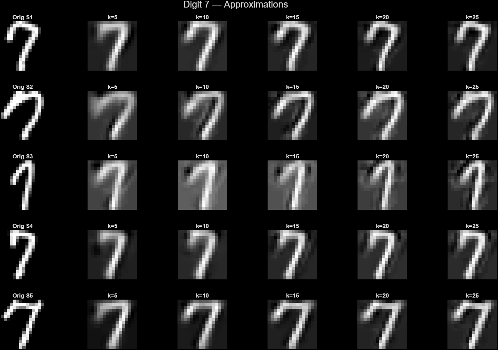

# Numerical Methods — Assignment 1
### SVD, PCA & Dimensionality Reduction

> **Course:** Numerical Methods &nbsp;|&nbsp; **Professor:** Rosanna Campagna &nbsp;|&nbsp; **Student:** Syed Hurair Ahmed Saha &nbsp;|&nbsp; **Due:** July 16, 2025

---

## Overview

This assignment explores **Singular Value Decomposition (SVD)** and **Principal Component Analysis (PCA)** as tools for dimensionality reduction, data visualization, image compression, and clustering — applied across four real-world datasets.

---

## Table of Contents

- [Problem 1 — Model Data Reduction](#1-model-data-reduction)
- [Problem 2 — Handwritten Digit Dataset](#2-handwritten-digit-dataset)
- [Problem 3 — Iris Dataset](#3-iris-dataset)
- [Problem 4 — Yale Face Dataset](#4-yale-face-dataset)
- [Repository Structure](#repository-structure)
- [Requirements](#requirements)
- [How to Run](#how-to-run)

---

## 1. Model Data Reduction

**Dataset:** `ModelReductionData.mat` — a 6×4000 data matrix

### Tasks
| Task | Description |
|------|-------------|
| 1.1 | Visualize all 15 two-dimensional projections via scatter plots |
| 1.2 | Center data, compute SVD, plot singular values, analyze effective dimensionality |
| 1.3 | Show scatter plots of the first few principal components |

### Key Findings
- All 15 pairwise scatter plots reveal **stretched, linearly correlated clusters**, suggesting significant redundancy in the 6D space.
- The singular value spectrum shows a sharp **"elbow" drop** after the first 2–3 components, indicating the data effectively lives in a **lower-dimensional subspace**.
- PCA scatter plots show no distinct cluster separation — data varies continuously along principal directions.

<p align="center">
  
  <br><em>Figure 1: All 15 two-dimensional projections of the 6D dataset</em>
</p>

<p align="center">
  
  <br><em>Figure 2: Singular value spectrum — steep elbow after index 2–3</em>
</p>

---

## 2. Handwritten Digit Dataset

**Dataset:** `HandwrittenDigits.mat` — 256×1707 matrix of 16×16 pixel digit images  
**Digits analyzed:** 0, 1, 3, 7 &nbsp;|&nbsp; **Samples per digit:** 5 &nbsp;|&nbsp; **k values:** 5, 10, 15, 20, 25

### Tasks
- Reconstruct digit images using increasing numbers of SVD principal components
- Visualize approximation quality and residual (error) images
- Plot the reconstruction error norm vs. number of components k

### Key Findings
- At **k=5**, reconstructions are blurry and barely recognizable — only gross structural variance is captured.
- At **k=25**, images closely match originals as finer details are progressively recovered.
- **Residual images** transition from structured (digit-like) patterns at low k, to random noise at high k — confirming SVD captures meaningful structure first.
- **Error norm plots** show a consistent monotonic decrease across all samples and all digits.

<p align="center">
  
  <br><em>Figure 3: Progressive reconstruction of digit '3' for k = 5, 10, 15, 20, 25</em>
</p>

<p align="center">
  
  <br><em>Figure 4: Reconstruction error norm vs. k for all digits</em>
</p>

---

## 3. Iris Dataset

**Dataset:** `IrisDataAnnotated.mat` — 4×150 matrix, 3 species (Setosa, Versicolor, Virginica)

### Tasks
- Center data and compute SVD
- Project onto first two principal components
- Visualize species clusters in the reduced 2D space

### Key Findings
- **Iris Setosa** forms a completely isolated, well-separated cluster — highly distinct from the other two species in the PC1–PC2 plane.
- **Versicolor** and **Virginica** show partial overlap, indicating shared characteristics but remaining mostly separable.
- PCA successfully compresses 4D information into 2D while **preserving species-discriminating structure**, validating PCA for exploratory analysis and feature engineering.

<p align="center">
  
  <br><em>Figure 5: PCA of Iris Dataset — species clusters in PC1 vs PC2 space</em>
</p>

---

## 4. Yale Face Dataset

**Dataset:** `Yale_64x64.mat` — 4096×165 matrix (64×64 pixel face images, 15 subjects × 11 conditions)

### Sub-tasks

| Section | Description |
|---------|-------------|
| 4.1 | Extract and display faces with low-rank approximation (k = 4, 8, 15) |
| 4.2 | Analyze the singular value spectrum (linear + log scale) |
| 4.3 | Visualize the first 5 feature vectors (eigenfaces) |
| 4.4 | Display approximation and error side-by-side for selected faces |

### Key Findings
- The singular value spectrum shows a **steep initial descent** followed by gradual decay — confirming strong low-rank structure.
- At **k=4**, faces are blurry but recognizable; by **k=15**, most identity-defining details are captured.
- The first 5 **eigenfaces** (columns of U) represent abstract patterns encoding dominant lighting and structural variation across all subjects.
- Error images become increasingly noise-like with higher k, confirming progressive capture of meaningful features.

<p align="center">
  
  <br><em>Figure 6: Original vs. approximations at k=4, 8, 15 for selected subjects</em>
</p>

<p align="center">
  
  <br><em>Figure 7: Singular value spectrum of Yale Face Dataset (linear and log scale)</em>
</p>

<p align="center">
  
  <br><em>Figure 8: First 5 eigenfaces (columns of U)</em>
</p>

---

## Repository Structure

```
numerical-methods-assignment/
│
├── README.md                      ← This file
│
├── src/                           ← All MATLAB source scripts
│   ├── problem1_model_reduction.m
│   ├── problem2_handwritten_digits.m
│   ├── problem3_iris_pca.m
│   └── problem4_yale_faces.m
│
├── figures/                       ← Output plots and visualizations
│   ├── model_reduction_scatter.png
│   ├── singular_values_model.png
│   ├── digit_approximations.png
│   ├── digit_error_norms.png
│   ├── iris_pca_clusters.png
│   ├── yale_face_approximations.png
│   ├── yale_singular_spectrum.png
│   └── yale_eigenfaces.png
│
├── data/                          ← Dataset files (not tracked by Git — see note below)
│   ├── ModelReductionData.mat
│   ├── HandwrittenDigits.mat
│   ├── IrisDataAnnotated.mat
│   └── Yale_64x64.mat
│
└── docs/
    └── Assignment1_Report.pdf     ← Full written report
```

> **Note on data files:** `.mat` files are excluded from version control via `.gitignore` due to file size and licensing. Download them from the course portal and place them in the `data/` directory before running any scripts.

---

## Requirements

- **MATLAB** R2020b or later (tested on R2023a)
- No additional toolboxes required — all functions used are part of MATLAB core

---

## How to Run

1. Clone the repository:
   ```bash
   git clone https://github.com/<your-username>/numerical-methods-assignment.git
   cd numerical-methods-assignment
   ```

2. Place dataset `.mat` files into the `data/` directory.

3. Open MATLAB and navigate to the project root.

4. Run each problem script from the `src/` folder:
   ```matlab
   run('src/problem1_model_reduction.m')
   run('src/problem2_handwritten_digits.m')
   run('src/problem3_iris_pca.m')
   run('src/problem4_yale_faces.m')
   ```

5. Figures will display in MATLAB and can be exported manually to `figures/`.

---

## Concepts Covered

`SVD` &nbsp; `PCA` &nbsp; `Dimensionality Reduction` &nbsp; `Low-Rank Approximation` &nbsp; `Eigenfaces` &nbsp; `Reconstruction Error` &nbsp; `Scatter Plot Analysis` &nbsp; `Singular Value Spectrum`

---

## License

This project is submitted for academic purposes as part of the Numerical Methods course. Not intended for redistribution.
